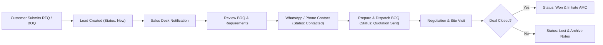
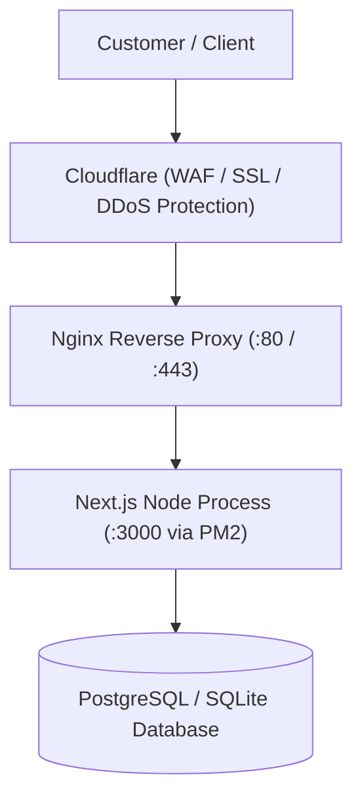

# NextGen IT Solution — Standard Operating Procedure (SOP) & System Documentation

**Document Code:** SOP-NG-IT-001  
**Version:** 1.0  
**Effective Date:** September 2026  
**Applicability:** Sales Team, Technical Support, Field Engineers, System Administrators  
**System Name:** NextGen IT Solution B2B Web Portal & Mini-CRM  

---

## 1. System Overview & Objective

### 1.1 Purpose
The NextGen IT Solution digital platform serves as the central revenue engine and operational backbone for corporate IT infrastructure, CCTV surveillance, structured cabling, server arrays, and AMC services across the **Vapi GIDC, Silvassa, Daman, Umbergaon, and Sarigam** industrial corridor.

### 1.2 Core Capabilities
1. **Public B2B Portal**: High-converting, 16-section industrial website with 15 core service catalogs and B2B product specifications.
2. **RFQ & BOQ Upload Engine**: Captures client tender/spec documents (PDF, Excel, Word) and routes them into the sales pipeline.
3. **Mini-CRM Pipeline**: Tracks client leads through sequential milestones (`New` $\rightarrow$ `Contacted` $\rightarrow$ `Quotation Sent` $\rightarrow$ `Negotiation` $\rightarrow$ `Won` / `Lost`).
4. **Mobile Instant Action Bar**: Direct connection to technical dispatch via `Call`, `WhatsApp`, and `Get Quote`.

---

## 2. Standard Operating Procedure (SOP) for Sales & Inquiries



### SOP Step 1: Receiving Inquiries
* **Trigger**: A client submits a quote via `/quote` or an inquiry via `/contact`.
* **Action**:
  1. Open the Admin CRM at [http://localhost:3000/admin/leads](http://localhost:3000/admin/leads).
  2. The new inquiry will appear at the top with status **`New`** in an amber badge.

### SOP Step 2: Reviewing Client Requirements & BOQ
* **Action**:
  1. Note the client's **Company Name**, **Contact Person**, **Phone**, and **Industrial Location** (e.g. Vapi GIDC Phase II, Piparia Silvassa).
  2. If the client attached a file, click the **"View BOQ"** button to download and inspect their Bill of Quantities spreadsheet or blueprint.

### SOP Step 3: First Response Protocol (SLA: Under 2 Hours)
* **Action**:
  1. Click the **WhatsApp** icon on the lead row to open a direct chat with the pre-filled reference text, or dial the client's phone directly.
  2. Confirm receipt of the inquiry and schedule a physical site inspection if required for cable path/camera angle survey.
  3. Change status from **`New`** $\rightarrow$ **`Contacted`**.

### SOP Step 4: Quotation Formulation & Dispatch
* **Action**:
  1. Calculate material costs (OEM volume discounts for Cisco, Hikvision, Sophos, Dell) and labor charges.
  2. Generate official quotation PDF with formal GST numbering.
  3. Email/WhatsApp quotation to client.
  4. Change lead status to **`Quotation Sent`**.
  5. Add quotation reference number into internal notes (e.g. `Quotation #Q-2026-104 sent for 80 Cat6 nodes`).

### SOP Step 5: Deal Finalization (Won / Lost)
* **If Won**:
  1. Change status to **`Won`**.
  2. Hand over file to Technical Field Operations for site execution.
  3. Offer Annual Maintenance Contract (AMC) registration.
* **If Lost**:
  1. Change status to **`Lost`**.
  2. Record reason in notes (e.g. `Project deferred to next quarter` or `Budget mismatch`) for quarterly sales review.

---

## 3. SOP for Technical Field Operations (Site Survey to Handover)

### Phase 1: Physical Site Survey
1. Verify industrial power grounding/earthing and server room temperature.
2. Calculate total cable run distances (ensure no copper run exceeds 90 meters; recommend fiber optic for $>90\text{m}$).
3. Map camera blind spots, entry/exit gates, and weighbridge angles.
4. Note presence of heavy electromagnetic machinery (specify shielded CAT6A or armored fiber if near high-voltage motors).

### Phase 2: BOQ Formulation
1. Detail itemized quantities:
   - Structured Cable boxes (CAT6 / CAT6A UTP/STP).
   - Patch panels (24-port / 48-port) and cable organizers.
   - Server racks (9U, 12U, 24U, 42U with PDU power strips).
   - Network switches (PoE+ watt budget calculation for CCTV).
   - Firewalls, Servers, and online UPS kVA ratings.
2. Include 15% spare port capacity for client future expansion.

### Phase 3: Certified Installation & Dressing
1. Lay all cables inside heavy-duty PVC/GI conduits or cable trays.
2. Label both ends of each network cable with printed ferrule markers.
3. Dress server racks with velcro ties (never overtighten with zip ties).
4. Perform fusion splicing on all optical fiber cores inside LIU enclosure.

### Phase 4: Audit & AMC Handover
1. Test 100% of network nodes with Fluke Cable Analyzer and export certification report.
2. Configure NVR recording schedules (H.265+, 25 fps, motion-based bitrate).
3. Hand over laminated network topology map and port matrix to client IT manager.
4. Transition account to Monthly AMC schedule.

---

## 4. System Administration & Maintenance SOP

### 4.1 Daily / Routine Operations

| Task | Frequency | Command / Path | Owner |
| :--- | :--- | :--- | :--- |
| **Check Dev/App Server** | Daily | `http://localhost:3000` | IT Admin |
| **Review Leads CRM** | Twice Daily | `/admin/leads` | Sales Desk |
| **Data Backup** | Weekly | Backup `data/` and `public/uploads/` | SysAdmin |
| **Security / Dependency Audit** | Monthly | `npm audit` | Lead Developer |

### 4.2 How to Start and Stop the Application

#### Starting the Development Server:
Open **PowerShell** and run:
```powershell
cd C:\Users\yatin.patel\.gemini\antigravity\scratch\nextgen-it-solutions
npm run dev
```
The server will boot on `http://localhost:3000`.

#### Building for Production:
```powershell
cd C:\Users\yatin.patel\.gemini\antigravity\scratch\nextgen-it-solutions
npm run build
npm run start
```

### 4.3 Managing Content & Data

#### Adding or Editing Services:
- Data file: `data/services.json` (or `src/lib/data.ts`)
- Format:
```json
{
  "id": "srv-13",
  "slug": "new-service-slug",
  "title": "Service Title",
  "category": "Networking",
  "shortDesc": "Brief summary for service cards",
  "iconName": "Network",
  "overview": "Detailed overview paragraph",
  "features": ["Feature 1", "Feature 2"],
  "components": ["Hardware 1", "Hardware 2"],
  "process": ["Step 1", "Step 2"],
  "industries": ["Manufacturing", "Pharma"],
  "faqs": [{ "question": "...", "answer": "..." }]
}
```

#### Adding or Editing Hardware Products:
- Data file: `data/products.json` (or `src/lib/data.ts`)
- Products immediately appear with category filter pills and "Request Best Price" triggers.

#### Backing Up System Data:
To safeguard customer leads and uploaded BOQ documents, copy these two folders to external storage or cloud drive:
- `C:\Users\yatin.patel\.gemini\antigravity\scratch\nextgen-it-solutions\data\` (Contains all leads, statuses, and notes)
- `C:\Users\yatin.patel\.gemini\antigravity\scratch\nextgen-it-solutions\public\uploads\` (Contains all client-uploaded BOQs)

---

## 5. Production Deployment SOP (VPS / Cloudflare / Nginx)

When deploying to a live domain (e.g. `nextgenitsolution.com`):



### Step 1: VPS Provisioning (Ubuntu Linux)
```bash
# Update server
sudo apt update && sudo apt upgrade -y

# Install Node.js 20+ & Nginx
curl -fsSL https://deb.nodesource.com/setup_20.x | sudo -E bash -
sudo apt install -y nodejs nginx

# Install PM2 Process Manager
sudo npm install -g pm2
```

### Step 2: Deploy Project
```bash
git clone <your-repo-url> /var/www/nextgen-it
cd /var/www/nextgen-it
npm install
npm run build

# Start with PM2 daemon
pm2 start npm --name "nextgen-it" -- start
pm2 save
pm2 startup
```

### Step 3: Configure Nginx Reverse Proxy
Edit `/etc/nginx/sites-available/nextgenitsolution.com`:
```nginx
server {
    server_name nextgenitsolution.com www.nextgenitsolution.com;

    client_max_body_size 15M;

    location / {
        proxy_pass http://127.0.0.1:3000;
        proxy_http_version 1.1;
        proxy_set_header Upgrade $http_upgrade;
        proxy_set_header Connection 'upgrade';
        proxy_set_header Host $host;
        proxy_cache_bypass $http_upgrade;
    }
}
```

### Step 4: SSL Certificate
```bash
sudo apt install certbot python3-certbot-nginx -y
sudo certbot --nginx -d nextgenitsolution.com -d www.nextgenitsolution.com
```

---

## 6. Troubleshooting & Emergency Protocols

| Issue | Root Cause | Solution |
| :--- | :--- | :--- |
| **Port 3000 already in use** | An earlier Next.js process is running in the background. | In PowerShell: `Get-Process node \| Stop-Process -Force`, then run `npm run dev`. |
| **Uploaded file too large error** | File exceeds 10MB limit. | Instruct client to compress PDF or email directly to `support@nextgenitsolution.com`. |
| **Lead not updating in CRM** | Browser cache holding previous state. | Click the **"Refresh"** button at top of `/admin/leads` or press `Ctrl + F5`. |
| **Node command not found in new terminal** | Windows PATH environment variable not refreshed. | Restart terminal or run: `$env:Path = [System.Environment]::GetEnvironmentVariable("Path","Machine") + ";" + [System.Environment]::GetEnvironmentVariable("Path","User")`. |

---

**Document Approval:**
- **Prepared By:** Antigravity AI Engineering Partner
- **Target Organization:** NextGen IT Solution
- **Region:** Vapi • Silvassa • Daman
